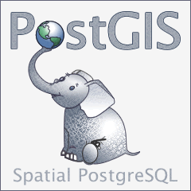
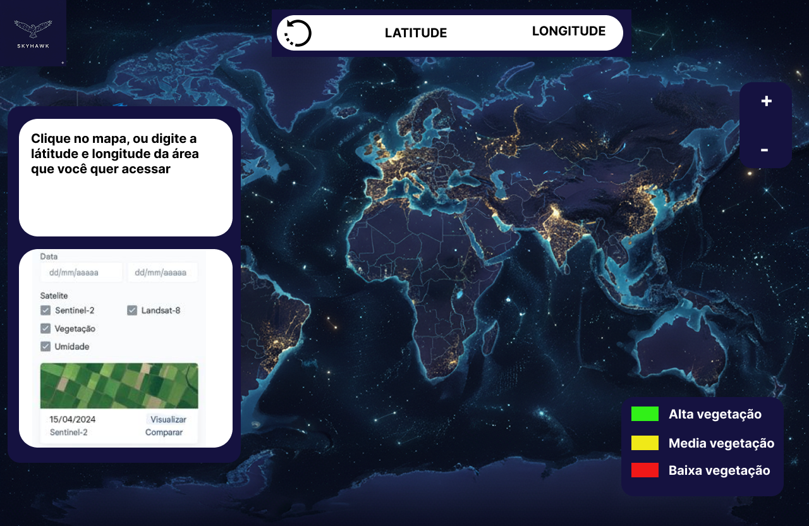
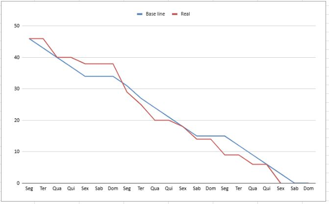

  

-----------------------------------------------------

## 📖 Sobre o Projeto
O crescente volume de dados geoespaciais de satélites representa um desafio para pesquisadores e profissionais na identificação e acesso a produtos de dados gratuitos para áreas de interesse. Atualmente, não há uma plataforma unificada que permita descobrir facilmente quais satélites oferecem dados para uma localização específica, suas resoluções e as variáveis disponíveis com um simples clique no mapa.

O projeto **SkyHawk** surge como uma solução para este problema, desenvolvendo uma aplicação web intuitiva e centralizada. A plataforma permitirá não só catalogar e visualizar os metadados de satélites gratuitos para qualquer ponto no espaço, mas também capacitará os usuários a comparar visual e analiticamente as saídas de dados, simplificando a escolha do produto geoespacial mais apropriado para suas aplicações. O sistema será um portal web de visualização com um mapa interativo como conceito principal.

-----------------------------------------------------

### 👥 Membros e Papéis

| Membro | Papel | GitHub |
|---|---|---|
| Christopher Costa | Product Owner | [chriskryon](https://github.com/chriskryon) |
| Marcos Vinicios S. A. Oliveira | Desenvolvedor | [marcknero](https://github.com/marcknero) |
| Mário César Vieira Alves | Desenvolvedor | [MarioC3sar](https://github.com/MarioC3sar) |
| Vinícius Lemes dos Santos | Scrum Master | [viniilemes](https://github.com/viniilemes) |

-----------------------------------------------------

## Tecnologias Utilizadas
O projeto foi desenvolvido utilizando um conjunto moderno de tecnologias para garantir desempenho, escalabilidade e facilidade de manutenção:

* **Node.js:** Plataforma para construção da estrutura do sistema, responsável por fornecer uma API RESTful para o front-end.
* **React:** Biblioteca JavaScript para construção da interface do usuário, garantindo uma experiência interativa e responsiva.
* **Vite:** Ferramenta de build rápida e moderna para o front-end, utilizada para desenvolvimento e empacotamento do projeto.
* **Figma:** Ferramenta de design utilizada para prototipagem e criação de interfaces interativas.
* **Bibliotecas de Mapas:** Mapbox para a rápida implementação de mapas interativos, com um vizual agradável com seu tema escuro.

  
  
  
  
  
  

-----------------------------------------------------
## Estrutura do Projeto
O projeto está organizado em três diretórios principais:

* **Back-end:** Contém toda a lógica do servidor, APIs (utilizando STAC e WTSS) e a comunicação com o banco de dados.
* **Front-end:** Inclui todos os componentes da interface do usuário construídos em React, responsáveis pela interatividade e visualização dos dados.
* **Banco de Dados:** Scripts e configurações para a criação e manutenção do banco de dados PostgreSQL com a extensão PostGIS.

-----------------------------------------------------

## 📷 Protótipo da Interface

  

-----------------------------------------------------
## Funcionalidades Principais

* **Seleção de Ponto de Interesse:** Permite que os usuários selecionem um ponto em um mapa interativo por clique ou coordenadas geográficas.
* **Listagem Dinâmica de Satélites:** Retorna uma lista de satélites com dados gratuitos disponíveis para a área selecionada, detalhando resoluções e variáveis.
* **Comparação de Séries Temporais:** Permite a visualização lado a lado de séries temporais de variáveis similares de diferentes satélites em gráficos.
* **Filtragem e Exportação:** Oferece opções para filtrar dados por satélite, variável ou período e permite a exportação de metadados.

-----------------------------------------------------
## Banco de dados
O projeto utiliza **PostgreSQL** com a extensão **PostGIS** como sistema de gerenciamento de banco de dados. Essa escolha se deve à robustez do PostgreSQL para aplicações complexas e ao poderoso suporte do PostGIS para armazenar, consultar e analisar dados geoespaciais, que são o núcleo da nossa aplicação.

-----------------------------------------------------
🌟🌟🌟🌟🌟🌟 **INFORMAÇÕES ACADEMICAS** 🌟🌟🌟🌟🌟🌟

Diretório dedicado à realização, organização e guarda dos arquivos, scripts e demais documentos referentes ao projeto do segundo semestre do curso de Desenvolvimento de Software Multiplataforma pela FATEC Jacareí, sob a orientação dos professores do curso.

-----------------------------------------------------
### Tema do semestre:
Aplicação Web para a visualização e comparação de dados geo-espaciais 

-----------------------------------------------------
### Desafio:
O crescente volume de dados geoespaciais provenientes de satélites, embora um recurso valioso, apresenta um desafio significativo para pesquisadores, estudantes e profissionais: a complexidade de identificar, acessar e comparar eficientemente os produtos de dados gratuitos disponíveis para uma área de interesse específica. Atualmente, não existe uma plataforma unificada que permita aos usuários, com um simples clique em um ponto do mapa, descobrir quais satélites oferecem dados para aquela localização, suas resoluções espacial e temporal, e as variáveis disponíveis (como NDVI, temperatura da superfície, umidade do solo etc.). Essa lacuna resulta em um processo demorado e muitas vezes frustrante de busca manual em diversas fontes, dificultando a rápida avaliação e comparação de produtos de dados semelhantes de diferentes missões de satélite.

-----------------------------------------------------
**Professor Focal Point:** RONALDO EMERICK MOREIRA (ronaldo.moreira@fatec.sp.gov.br) 

**Cliente:** INPE - Laboratório de Sensoriamento Remoto em Agricultura - Dr. Marcos Adami 
-----------------------------------------------------

## Requisitos do Projeto

### Requisitos Funcionais:

#### 🗺️ Interação com o mapa (RF01)
**Como** pesquisador geoespacial
**Eu quero** clicar em um ponto do mapa interativo ou inserir coordenadas geográficas
**Para que** eu possa selecionar rapidamente uma área de interesse para análise de dados de satélite 

---

#### 🛰️ Listagem de satélites e variáveis disponíveis (RF02)
**Como** estudante de geociências
**Eu quero** visualizar uma lista de satélites com dados gratuitos disponíveis para a área selecionada
**Para que** eu possa entender quais missões oferecem dados relevantes e suas resoluções espaciais e temporais 

---

#### 📊 Comparação de séries temporais (RF03)
**Como** analista ambiental
**Eu quero** comparar visualmente séries temporais de variáveis similares de diferentes satélites
**Para que** eu possa escolher o produto mais adequado para minha análise, como o NDVI do Sentinel-2 versus Landsat-8 

---

#### 🔍 Filtragem e exportação de dados (RF04)
**Como** profissional de geoprocessamento
**Eu quero** filtrar os dados por satélite, variável ou período de tempo e exportar os metadados e dados brutos/processados
**Para que** eu possa realizar análises mais específicas e utilizar os dados em outras ferramentas 

### Requisitos Não Funcionais:

#### 🧭 Interface intuitiva (RNF01)
**Como** usuário sem experiência prévia em geoprocessamento
**Eu quero** navegar por uma interface clara e intuitiva
**Para que** eu consiga utilizar a plataforma sem dificuldades técnicas 

---

#### ⚡ Desempenho otimizado (RNF02)
**Como** usuário da plataforma
**Eu quero** que o mapa e os dados carreguem rapidamente e que a interação seja fluida
**Para que** eu não perca tempo esperando ou enfrentando travamentos durante a análise 

---

#### 📈 Escalabilidade (RNF03)
**Como** administrador da plataforma
**Eu quero** que a aplicação suporte um número crescente de usuários e fontes de dados
**Para que** o sistema continue funcional e eficiente conforme a demanda aumenta 

---

#### ✅ Confiabilidade dos dados (RNF04)
**Como** pesquisador acadêmico
**Eu quero** ter certeza de que os dados exibidos são precisos, atualizados e corretamente atribuídos às suas fontes
**Para que** eu possa confiar nos resultados obtidos para publicações e decisões técnicas 

### Restrições de Projeto:

#### 🆓 Uso exclusivo de dados gratuitos (RP01)
**Como** desenvolvedor da aplicação
**Eu quero** utilizar apenas dados de satélites gratuitos como Landsat, Sentinel e MODIS
**Para que** a plataforma seja acessível a todos os usuários sem custos adicionais 

---

#### ⏳ Escopo viável para alunos (RP02)
**Como** estudante desenvolvedor
**Eu quero** delimitar claramente o escopo do projeto
**Para que** eu consiga entregar um produto mínimo viável dentro do tempo disponível 

---

#### 💾 Limites de infraestrutura (RP03)
**Como** responsável técnico
**Eu quero** considerar as limitações de recursos computacionais e de armazenamento
**Para que** o sistema funcione bem mesmo com infraestrutura modesta 
---

## 🏁 Sprint 1 — Planejamento e protótipo funcional

| Código | Tarefa | Definition of Ready | Definition of Done |
|---|---|---|---|
| GAP-0001 | Planejamento inicial e definição do escopo do sistema | Equipe reunida, desafio compreendido, metas iniciais definidas | Documento de escopo validado e compartilhado com todos os membros |
| GAP-0002 | Estruturação da arquitetura geral e tecnologias utilizadas | Tecnologias escolhidas, escopo definido | Diagrama da arquitetura e stack documentada |
| GAP-0003 | Modelagem dos componentes principais e definição dos entregáveis | Escopo e arquitetura definidos | Modelos de componentes e backlog inicial criado |
| IHC-0001 | Desenvolvimento de protótipo no Figma | Escopo visual definido, requisitos funcionais mapeados | Protótipo navegável no Figma com telas principais |
| IHC-0004 | Definição de fluxos de navegação intuitivos | Protótipo inicial criado | Fluxos validados com base em heurísticas de usabilidade |
| TC-0001 | Implementação da seleção de ponto no mapa interativo | Protótipo funcional, biblioteca de mapa definida | Clique no mapa retorna coordenadas corretamente |
| TC-0002 | Integração com APIs de satélites para consulta de metadados | API definida e acessível, coordenadas disponíveis | Dados de satélite retornados corretamente para ponto selecionado |
| BDN-0001 | Modelagem de estrutura de metadados de satélites | Requisitos de dados definidos | Estrutura criada no MongoDB e validada com dados simulados |
| DW-0001 | Criação da interface do mapa interativo com seleção por clique | Protótipo validado, biblioteca de mapa integrada | Mapa funcional com interação de clique |
| DW-0002 | Exibição dinâmica de satélites e variáveis disponíveis | API integrada, estrutura de dados pronta | Lista de satélites e variáveis exibida corretamente após seleção |

---

## 🚀 Sprint 2 — Comparação visual e testes de usabilidade

| Código | Tarefa | Definition of Ready | Definition of Done |
|---|---|---|---|
| GAP-0005 | Implementação e execução de testes unitários e de integração | Funcionalidades desenvolvidas e documentadas | Testes automatizados executados com cobertura mínima definida |
| GAP-0006 | Validação dos requisitos funcionais com base nos testes | Testes executados e resultados disponíveis | Checklist de requisitos validado com base nos testes |
| GAP-0007 | Ajustes técnicos e refinamento do backlog | Feedback dos testes e usuários coletado | Backlog atualizado com melhorias e correções priorizadas |
| IHC-0002 | Testes de usabilidade com usuários | Protótipo funcional disponível | Relatório de usabilidade com insights e sugestões |
| IHC-0003 | Refinamento da interface com base no feedback | Relatório de usabilidade analisado | Interface ajustada e validada com novo teste rápido |
| TC-0003 | Desenvolvimento da lógica de comparação de séries temporais | Dados disponíveis e estrutura de séries pronta | Comparação funcional entre séries de diferentes satélites |
| TC-0004 | Implementação de filtros por satélite, variável e período | Interface e dados prontos | Filtros aplicáveis e funcionais na interface |
| BDN-0002 | Armazenamento de séries temporais e variáveis geoespaciais | Estrutura de dados definida | Dados armazenados corretamente e acessíveis via API |
| BDN-0003 | Implementação de filtros e consultas eficientes | Dados armazenados e filtros definidos | Consultas otimizadas e testadas com diferentes parâmetros |
| DW-0003 | Visualização lado a lado de séries temporais em gráficos | Dados comparáveis disponíveis | Gráficos exibindo corretamente as séries selecionadas |
| DW-0004 | Implementação de filtros e painel de controle | Filtros definidos e interface preparada | Painel funcional com filtros aplicáveis e responsivos |
| DW-0005 | Implementação de filtros e painel de controle | Filtros definidos e interface preparada | Painel funcional com filtros aplicáveis e responsivos |

---

## 🎯 Sprint 3 — Exportação, otimizações e entrega final

| Código | Tarefa | Definition of Ready | Definition of Done |
|---|---|---|---|
| GAP-0007 | Testes de performance, escalabilidade e confiabilidade | Sistema funcional completo | Relatório de testes com métricas de desempenho e confiabilidade |
| GAP-0008 | Documentação técnica do sistema e dos endpoints | Funcionalidades estáveis e validadas | Documentação publicada e acessível para desenvolvedores e usuários |
| GAP-0009 | Preparação para entrega final e apresentação do sistema | Sistema testado e documentado | Sistema implantado, apresentação preparada e entregue |
| IHC-0005 | Design responsivo para diferentes dispositivos | Interface final definida | Layout adaptado e testado em diferentes resoluções |
| TC-0005 | Exportação de dados e metadados em formatos compatíveis | Dados disponíveis e estrutura de exportação definida | Exportação funcional em formatos como CSV ou JSON |
| BDN-0004 | Estratégia de cache para otimizar performance | Dados acessados com frequência identificados | Cache implementado e validado com melhoria de tempo de resposta |
| BDN-0005 | Garantia de integridade e atualização dos dados | Estrutura de dados e fontes definidas | Validação automática de dados e atualização periódica implementada |
| DW-0005 | Otimização de carregamento e responsividade | Interface final pronta | Sistema leve, rápido e responsivo em diferentes dispositivos |

---

## 📈 Gráfico de Burndown

Este é o gráfico de evolução das tarefas do projeto (burndown chart), mostrando o progresso ao longo das sprints.

  

---
